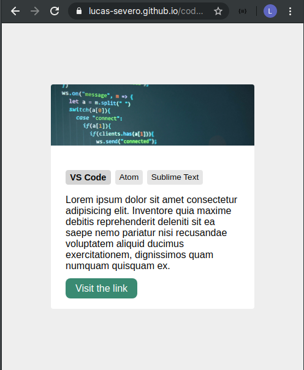

<h1 align="center">
Hora do código - Módulo 02
</h1>

<h2 align="center">
    
Projeto desenvolvido para o aprendizado da metodologia BEM CSS

    
Site: <a href="https://lucas-severo.github.io/codenation/modulo2/hora-do-codigo/" target="_blank" rel="noopener noreferrer">BEM CSS</a>

</h2>

    

### Tecnologias:
- HTML
- CSS

### Metodologias:
- BEM CSS

### Licença:
[MIT](https://choosealicense.com/licenses/mit/)